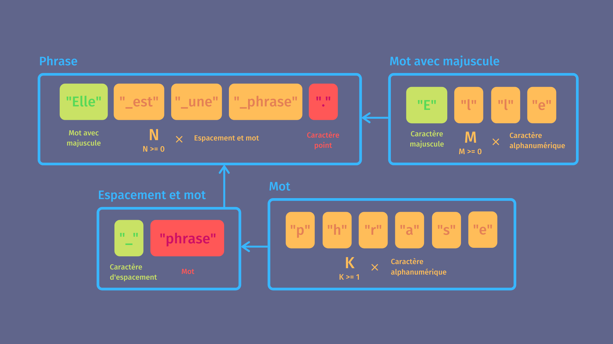
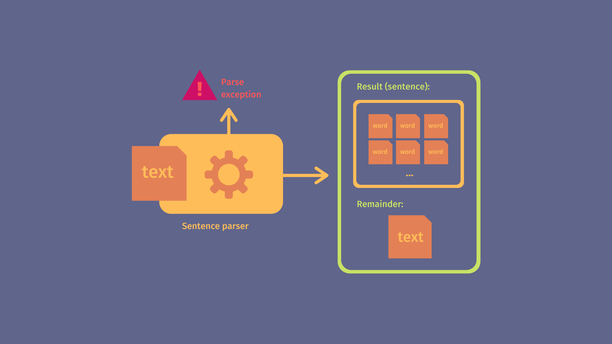
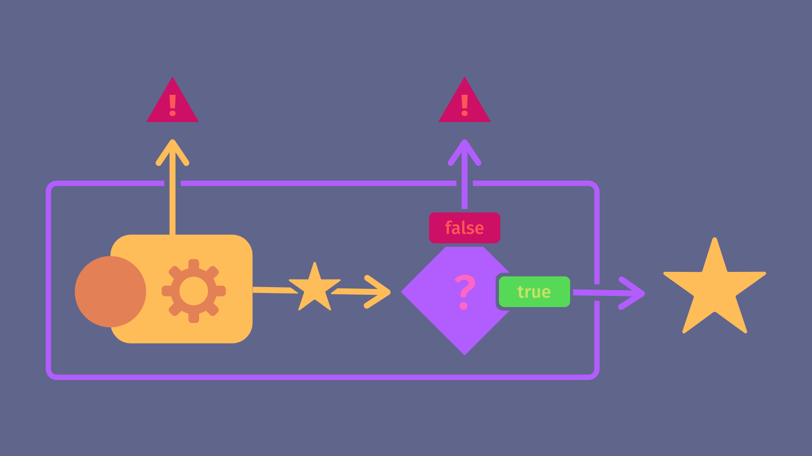
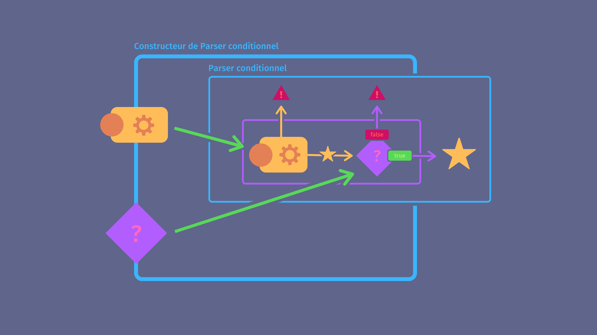
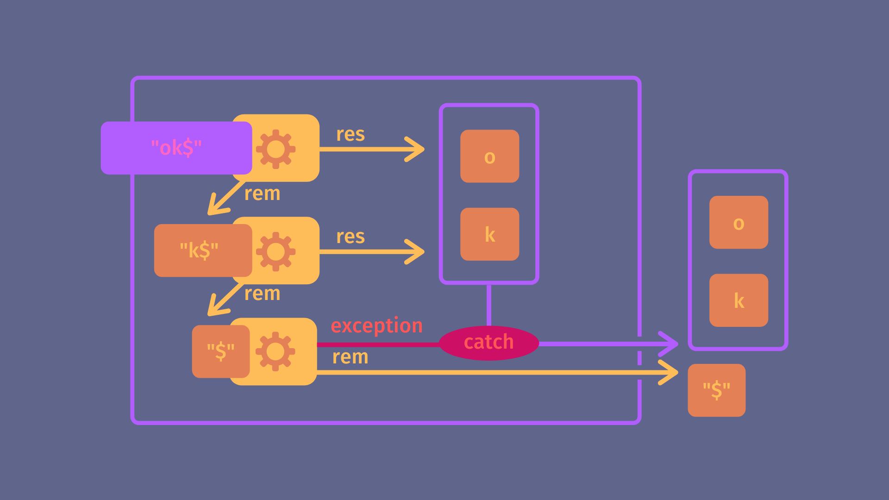

*Toutes les illustrations sont de l'auteur.*

# À la découverte des parsers

Un parser est un traducteur. Un programme capable de prendre une information exprimée dans un format A, de la lire, de l'analyser, parfois même de l'enrichir, puis de rendre le tout dans un format B.

Pensez aux langages de programmation, formats de fichiers, protocoles de communication. Tous dépendent d'une multitude de parsers successifs pour fonctionner, que ce soit pour la compilation, l'interprétation, l'analyse syntaxique, le formatage automatique, la  configuration, la correction orthographique... Nous utilisons constamment des programmes qui lisent du texte, identifient des motifs et en construisent des représentations internes qui peuvent être analysées.

## L'objectif

Nous réaliserons un parser capable d'identifier une phrase (de façon simplifiée) et de renvoyer tout ses mots. 

Nous utiliserons la technique de "recursive descent" pour construire notre parser final, ce qui mettra en lumière quelques bonnes idées de la programmation orientée fonction, un paradigme complémentaire à l'orienté objet et que beaucoup de programmeurs ne connaissent malheureusement pas.

Nous nous servirons du langage **Typescript**, basé sur Javascript. Il faudrait normalement utiliser un langage plus bas-niveau en raison du caractère critique d'un tel outil, mais la simplicité de Javascript et les types de Typescript nous permettront de mieux visualiser les structures pour faciliter une réimplémentation dans des langages plus performants et "stricts".

Je mets cependant à votre disposition deux autres exemples de "recursive descent", un en orienté fonction avec [Rust](https://github.com/AnicetNgrt/parser_combinators) et l'autre en orienté objet avec [Java](https://github.com/AnicetNgrt/SentenceParserCombinators).

# Implémentation

## Formule d'une phrase

Pour parser une phrase, il faut déjà identifier ce dont elle est composée. Dans notre cas ce sera d'**un ou plusieurs mots**, mots composés d'**un ou plusieurs caractères alphanumériques**, le premier commençant par **une majuscule**, le dernier finissant par un **point**, tous séparés d'**un espace**. 

Nous allons nous limiter à ces quelques règles pour simplifier. Mais si vous souhaitez ajouter des règles de grammaire et de syntaxe avancées (par exemple : sujet, verbe, complément) je vous invite à vous renseigner sur les "parse tree", un outil complémentaire que je ne traiterai pas dans cet article.

Exemple de phrases valides selon nos critères :

```
Je suis une phrase.     -> valide, resultat: ["Je", "suis", "une", "phrase"]
Je.                     -> valide, resultat: ["Je"]
je.                     -> incorrect
Je                      -> incorrect
Je suis une phrase .    -> incorrect
Je   suis une  phrase.  -> incorrect
```

On en déduit la formule pseudo-mathématique d'une "phrase" :

```python
mot = n*char_alphanum
mot_maj = char_alphanum_maj + k*char_alphanum
phrase = mot_maj + k*(char_espacement + mot) + "."  

n entier >= 1, k entier >= 0
```



Ce qui veut dire qu'on doit pouvoir parser :

- un caractère `"."`
- un caractère alphanumérique (`a`, `b`, `c` ... `8`, `9`, `0`)
- un caractère alphanumérique en majuscule
- un caractère considéré comme un espace (`" "`, `"\n"` ...)

Et faire des opérations sur ces parsers :

- répéter une ou plusieurs fois un parser (pour mot et espacement)
- répéter zero ou plusieurs fois un parser (pour les premiers mots d'une phrase)
- combiner deux parsers (pour tous les `+`)

## Fonction parser



Nous prenons une approche orientée fonction, donc chaque parser sera une fonction. Ces fonctions renverront le résultat du parsing appliqué au texte donné en entrée.

```ts
const res = parse_phrase("Ma phrase."); // ["Ma", "phrase"]
```

On voudra aussi renvoyer la partie pas traitée par le parser, pour pouvoir parser plusieurs fois à la suite.

```ts
const { res, rem } = parse_phrase("Ma phrase1.Ma phrase2.suite");
// { res: ["Ma", "phrase1"], rem: "Ma phrase2.suite" }

const { res, rem } = parse_phrase(rem);
// { res: ["Ma", "phrase2"], rem: "suite" }
```

Dans le cas où l'entrée ne sera pas valide on renverra une exception.

```ts
parse_phrase("  je ne suis pas une phrase");
// ParseError {
//      reason: "unexpected whitespace",
//      input: "  je ne suis pas une phrase"
// }
```

On en déduit déjà deux types :

```ts
type ParseResult<R> = {
    res: R, // "Traduction" trouvée par le parser
    rem: string // Reste à parser
};

type Parser<R> = (input: string) => ParseResult<R>;
```

Et une exception :

```ts
class ParseError extends Error {
    constructor(public input: string, message?: string) {
        super(message);
    }
}
```

## Parsers de départ

Commençons par parser un unique caractère en le renvoyant en résultat :

```ts
// Parse un caractère, renvoie le caractère et le reste de l'input
// Si aucun caractère, erreur
const parse_char = (input) => {
    if (input.length < 0) {
        throw new ParseError(input, "Expected a character, got nothing.");
    }
    
    return { 
        res: input[0], 
        rem: input.substr(1) 
    }
}

const { res, rem } = parse_char("Hello");
// { res: 'H', rem: 'ello' }
```

Parfait ! C'était le plus simple, passons à la suite.

## Fonctions du premier ordre



Maintenant qu'on peut parser la présence d'un caractère, il faut vérifier certaines conditions dessus, par exemple si l'on veut parser un espace alors on doit regarder si c'est un espace, si l'on veut parser un point, si c'est un point et ainsi de suite...

Notre premier instinct serait de faire une fonction qui parse un caractère puis essaye de valider une condition booléenne dessus. Cette condition serait une fonction prenant le caractère en question et renvoyant vrai ou faux. Si la condition passe on renverra le caractère, sinon on aura une exception.

```ts
type Condition<T> = (val: T) => boolean;

// Parser de char qui applique une condition
const parse_char_cond = (input, cond: Condition<string>) => {
    const { res, rem } = parse_char(input);

    if (!cond(res)) {
        // Si la condition n'est pas validée, il y a erreur
        throw new ParseError(input);
    }

    return { res, rem };
}

// Notre parseur de points s'écrit maintenant en une seule ligne !
const parse_dot = input => parse_char_cond(input, c => c === ".");

console.log(parse_dot(".hello")); // { res: '.', rem: 'hello' }
```

Pour `parse_char_cond` on parle de "fonction du premier ordre", c'est à dire une fonction qui prend d'autres fonctions en paramètre. C'est très utile car ça permet de ne pas dupliquer de code entres les différents parsers conditionnels qu'on va devoir implémenter.

## Functors



Le code écrit jusqu'ici n'est pas si bien. Imaginez un instant que vous vouliez ensuite faire un parser qui valide une condition sur autre chose qu'un caractère. Par exemple si maintenant vous vouliez parser un mot et en plus valider que ce mot a une majuscule, alors vous devriez réécrire une logique très semblable mais en remplaçant `parse_char` par `parse_word` (supposons qu'elle existe).

On doit rajouter le parser à utiliser en argument et renommer la fonction `parse_char_cond` en `parse_cond` pour marquer le fait qu'on ne parsera plus nécessairement un caractère.

```ts
// Fonction qui prend deux fonctions en paramètre
// Parse avec la première et filtre avec la seconde
const parse_cond = <R>(input: string, parser: Parser<R>, cond: Condition<R>) => {
    const { res, rem } = parser(input);
    if (!cond(res)) {
        throw new ParseError(input);
    }
    return { res, rem }; 
};

const parse_dot = (input) => parse_cond(
    input,
    parse_char,
    (c) => c === "."
);
```

Mais on peut faire encore mieux. 

Plus tard, le parser de phrase va utiliser `parse_cond` de la même manière plusieurs fois. Par exemple pour chaque caractère de chaque mot il va appeler `parse_cond` avec le même parser `parse_char` et la même condition `is_alphanumeric`. Et même si le temps nécessaire à l'envoi d'une fonction dans une autre est négligeable, si l'on fait ça sur des textes de plusieurs millions de mots, on va répéter des millions de fois cet appel (on souhaite éviter les feux de datacenters à Strasbourg).

Pour résoudre ce problème nous n'allons pas faire un parser, mais une fonction qui va construire des variantes de `parse_cond` qu'on pourra appeler ensuite sans repasser tous les arguments.

```ts
// cond_parser renvoie une fonction.
// C'est une sorte d'usine à fonctions.
const cond_parser = <R>(parser: Parser<R>, cond: Condition<R>) => {
    return (input: string) => {
        const { res, rem } = parser(input);
        if (!cond(res)) {
            throw new ParseError(input);
        }
        return { res, rem };
    }
}
```

Lorsqu'une fonction en renvoie une autre on parle de "functor". On peut voir ça comme l'équivalent d'une "factory" en orienté objet.

Donc maintenant on peut réécrire notre parser de points comme ceci :

```ts
const parse_dot = cond_parser(
    parse_char,
    (c) => c === "."
);

const { res, rem } = parse_dot(".hello");
```

Et pour parser les autres types de caractères qui nous intéressent :

```ts
const is_whitespace = str => str.trim() === '';
const is_alphanum = str => str.match(/^[\p{sc=Latn}\p{Nd}]+$/u);
const is_maj = str => str === str.toUpperCase();

const parse_space = cond_parser(parse_char, is_whitespace);
const parse_alphanum = cond_parser(parse_char, is_alphanum);
const parse_maj_alphanum = cond_parser(parse_alphanum, is_maj);
```

Vous voyez qu'avec cette technique nos parsers sont devenus très facilement composables. Regardez comme on utilise `parse_alphanum` pour construire `parse_maj_alphanum`. Ce qui forme une chaîne de parsers `parse_char -> parse_alphanum -> parse_maj_alphanum` où on ajoute simplement une nouvelle condition à chaque étape. Donc tout se compose très naturellement.

## Parsers répétés



Nous allons maintenant créer un functor qui, à partir d'un parser A, créé un parser B répétant A autant de fois que possible, renvoyant alors la liste de tous les résultats accumulés de A. Ce qui nous donnera la possibilité de répéter un parser zéro fois ou plus. Par exemple pour parser les caractères après la majuscule, comme indiqué dans la formule de départ.

```ts
const zero_or_more = <R>(parser: Parser<R>) => {
    return (input: string) => {
        const res_list = [];

        let next_input = input;
        while (true) {
            try {
                const { res, rem } = parser(next_input);
                res_list.push(res);
                next_input = rem;
                // Si il n'y a plus rien à parser on s'arrête
                if (next_input === '') {
                    break;
                }
            // Si ça ne marche plus on s'arrête
            } catch(ignored) {
                break;
            }
        }
        return { res: res_list, rem: next_input };
    }
}
```

Ce qui nous donne par exemple :

```ts
zero_or_more(parse_alphanum)("hello");
// { res: [ 'h', 'e', 'l', 'l', 'o' ], rem: '' }
zero_or_more(parse_maj_alphanum)("HEllo");
// { res: [ 'H', 'E' ], rem: 'llo' }
```

À partir de ce `zero_or_more` on crée ensuite un `one_or_more` qui va répéter un parser comme `zero_or_more` mais qui va planter si ça ne marche pas au moins une fois.

```ts
const one_or_more = <R>(parser: Parser<R>) => {
    const zero_or_more_parser = zero_or_more(parser);
    return (input: string) => {
        const { res, rem } = parser(input);
        const { res: res_list, rem: final_rem } = zero_or_more_parser(rem);
        return { 
            res: [res, ...res_list], 
            rem: final_rem 
        };
    }
}
```

On évite encore une fois les répétitions en utilisant `zero_or_more` dans `one_or_more`.

## Parser combinator

Il ne nous reste plus qu'un outil à créer, l'additionneuse de parsers, ou "parser combinator". Cette dernière va exécuter deux parsers à la suite en utilisant le reste du premier dans l'entrée du second. Il combinera les deux résultats dans une liste.

```ts
const pair = <R1, R2>(parser1: Parser<R1>, parser2: Parser<R2>) => {
    return (input: string) => {
        const { res: res1, rem: rem1 } = parser1(input);
        const { res: res2, rem: rem2 } = parser2(rem1);
        return { res: [res1, res2], rem: rem2 }
    }
}
```

L'on veut aussi pouvoir modifier un petit peu ce résultat à l'aide d'une fonction. Par exemple dans le cas du mot avec une majuscule, combiner la majuscule avec les lettres suivantes pour reconstruir le mot initial.

```ts
const map = <R1, R2>(parser: Parser<R1>, modifier: (res: R1) => R2) => {
    return (input: string) => {
        const { res, rem } = parser(input);
        return { res: modifier(res), rem }
    }
}
```

## Parser de phrase

Maintenant qu'on a tous nos blocs, l'on peut construire le parser final en nous aidant de la définition établie précédemment.

```ts
// N caractères alphanum, N > 0
const parser_mot = map(
    one_or_more(parse_alphanum),
    (res) => res.join('') // On combine les lettres
);

// espace + mot
const parser_espacement_et_mot = map(
    pair(parse_space, parser_mot),
    (res) => res[1] // On rejette l'espace
);

// majuscule + K caractères alphanum, K >= 0
const parser_mot_avec_majuscule = map(
    pair(
        parse_maj_alphanum,
        zero_or_more(parse_alphanum)
    ),
    (res) => [res[0], ...res[1]].join('') 
    // On combine la majuscule et les lettres
);
```

Et finalement le parser de phrase qu'on sépare en deux pour la lisibilité :

```ts
// partie 1 : mot avec majuscule + M mots, M >= 0
const parser_debut_phrase = map(
    pair(
        parser_mot_avec_majuscule,
        zero_or_more(parser_espacement_et_mot)
    ),
    (res) => [res[0], ...res[1]]
    // On combine le mot avec majuscule et les autres mots
);

// partie 2 : prise en compte du point final
const parser_phrase = map(
    pair(parser_debut_phrase, parse_dot),
    (res) => res[0] // on ne garde que les mots
);
```

Mission accomplie !

```ts
parser_phrase("Je suis une phrase. Ensuite...");
// { res: [ 'Je', 'suis', 'une', 'phrase' ], rem: ' Ensuite...' }
```

# Conclusion


C'était long, mais au moins ~~maintenant vous pouvez vous passer des regex!~~